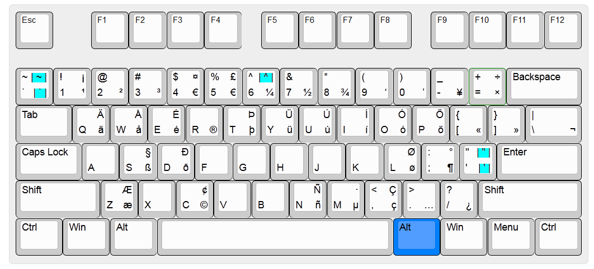

AltGr AutoHotkey scripts
=========================

# AltGr Progammer extension 

Makes available commonly needed programmer characters such as brackets and symbols, available in convenient locations on the keyboard. Avoid awkward stretching for those common keys.

- Hold AltGr then press another key to get the desired character.  AltGr is an ideal key as it can be hit with the right thumb.
- Most common characters used by programmers are on the home row.
- Characters on upper letter row are equivalent to a Shift plus a number key, making it earier to remember symbols.
- Also implements some of the AltGr International Extension (see below) so you can also type many extended and accented characters via dead keys.

UK keyboard shown. Should work fine on other layouts too.

# AltGr International extension 

Makes a variety of accented characters, currency, mathematical and other symbols all available via the AltGr key.

It is largely based on the US International keyboard layout, which allows a wide variety of characters to be typed but has some shortcomings: (i) the apostrophe key is redefined and becomes a dead key and (ii) it is only available for US layouts.

Using this script, all standard key presses remain unchanged, and is intended to work on both US and UK keyboards. All the additional characters can be typed with the help of the AltGr key. There are also some dead-key combinations which can be used to type an even wider variety of additional characters, again using the AltGr key.

The key mappings defined by the script are shown in blue and can be produced by holding down the AltGr key. Dead keys are indicated with a blue background.

Examples:

© : AltGr + c

á : AltGr + a

½ : AltGr + 7

Ñ : AltGr + ~ then N

â : AltGr + ^ then a

Ü : AltGr + " then U

